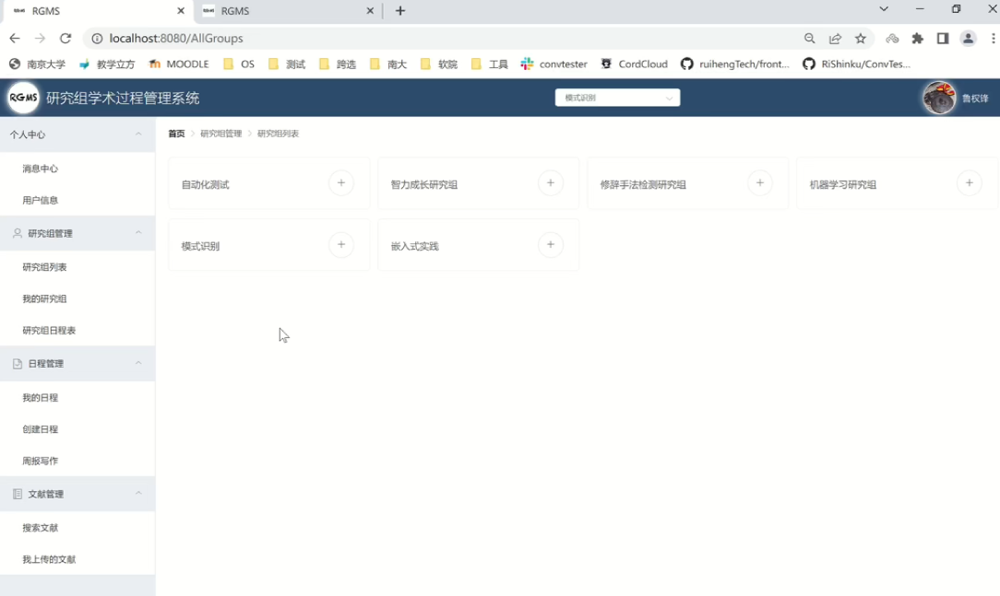
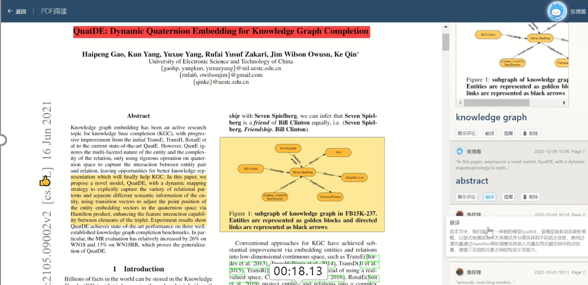
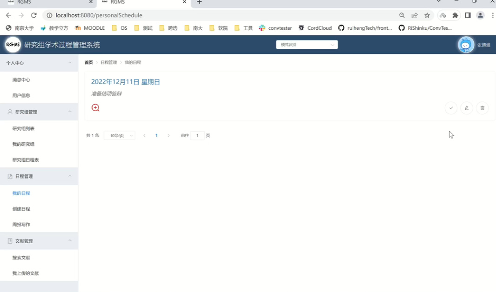
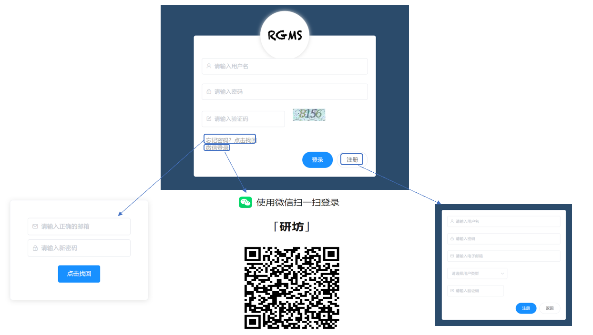

# Research-fun
It's a project aimed at improving researchers' team work and paper reading.

[This ppt](https://docs.google.com/presentation/d/1sowoQDihoNfM29OgU5VLkAI-RrUgOVjj/edit?usp=sharing&ouid=112098714375028312387&rtpof=true&sd=true) shows our website's effects.

Here are some pics:

